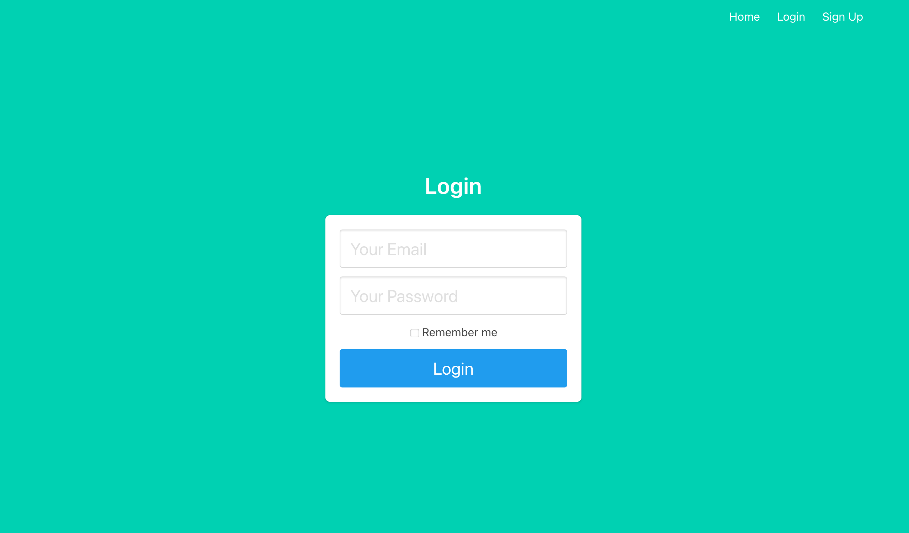

# Flask apps
Experimentation with Python's Flask library, a web microservice.

## 1. [Linear regression](#linear_regression)
An app that takes in a JSON of x- and y-coordinates, trains a linear regression, and returns the model parameters.

## 2. [Datasender](#datasender)
My first success at having JavaScript and Python communicate with each other. Click a button to append values to a list at a Flask endpoint.

## 3. [Gauss update](#gauss_update)
Dynamically update a plot of a normal distribution with sliders for the mean and standard deviation.

## 4. [Authentication](#authentication)

A tiny proof-of-concept app with user login and authentication, following [this excellent tutorial](https://www.digitalocean.com/community/tutorials/how-to-add-authentication-to-your-app-with-flask-login) from DigitalOcean.
