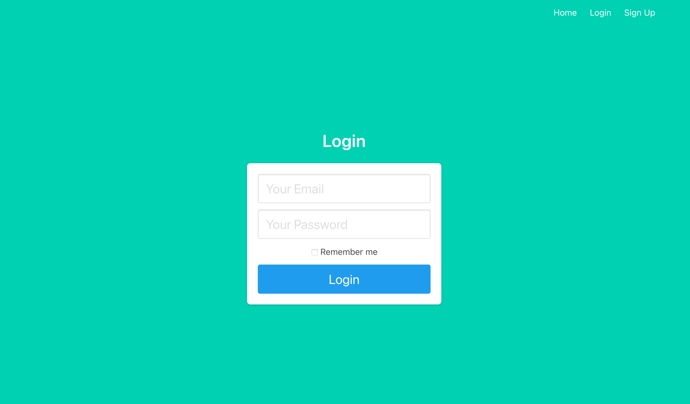

# Authentication in Flask
Practice for authenticating users, following [this tutorial](https://www.digitalocean.com/community/tutorials/how-to-add-authentication-to-your-app-with-flask-login) from DigitalOcean. Uses Flask (`flask`, `flask-login`, and `flask-sqlalchemy`) and SQLite.



## How to run it
Run the following in Terminal in the root directory of this project (`authentication`):

```bash
export FLASK_APP=project
export FLASK_DEBUG=1
```

The database tables also must be instantiated for the app to work. Open a Python instance in the root directory of this project and type:

```python
from project import db, create_app
db.create_all(app=create_app())
```

To run this project, type:

```bash
flask run
```

## How to build it
The tutorial goes into excellent detail on how to create the app. But in summary:
1. Create an `__init__.py` file with blueprints for `main.py` and `auth.py`, which contain the Flask endpoints for your main and authorization pages, respectively
2. Start the `main` and `auth` endpoints
3. Create the HTML pages and point the endpoints towards the pages
4. Create a user model and configure the SQLite database.
5. Make the user creation and login functions check the SQLite database before approving or denying requests
6. Use Flask-Login to create sessions for logged-in users, and deny access to certain pages if users aren't logged in
7. Polish the HTML pages based on whether users are logged in or not
