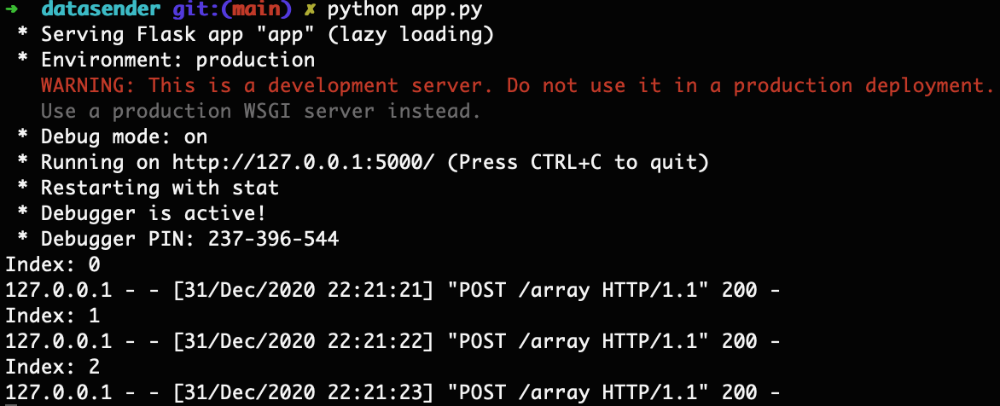

# Sending data from JavaScript to Flask
## Background
Here's a challenge that took me quite a while to figure out and I'm excited to share. The basic premise is that we want to allow users' interactions with a webpage to send data to a Flask endpoint. This could mean typing in a phrase that gets sent to an NLP spam filter, regenerating a predictive model based on new data, etc. By combining JavaScript and Python, we have the nice interactive nature of JS in the browser, but we also have the machine learning capabilities of Python.

Here, we'll do something a *lot* simpler. (Hey, you have to start somewhere!) We'll create a Flask app where whenever a user clicks a button on a page, JavaScript updates a variable and sends it to a Flask endpoint, which appends the data to a list. We can then use Python separately to request data from the URL and visualize the contents of the list.

## Table of contents
1. [The play by play](#the-play-by-play)
  1. [Flask](#1-flask)
  2. [HTML](#2-html)
  3. [JavaScript](#3-javascript)
2. [Using the app](#using-the-app)
3. [Conclusions](#conclusions)

## The play by play
### 1. Flask
First, we create the "engine" of our application using Flask in `app.py`. We first load our libraries, create a `Flask` instance, and instantiate a variable called `GLOBAL_LIST`.

```python
import pandas as pd
from flask import Flask, jsonify, request, render_template

app = Flask(__name__)

GLOBAL_LIST = []
```

We then create two endpoints:
* A landing page that will serve our webpage with the button
* The endpoint that contains the values of `GLOBAL_LIST`. The endpoint for our webpage with the button is simple: we just render our HTML with `render_template`. Note that Flask expects `index.html` to be in a `templates` folder.

```python
@app.route('/')
def index():
    return render_template("index.html")
```

Our second endpoint is a little more complicated, as we need functionality for both sending data to the endpoint (`POST`) and when we later request data back (`GET`). We use Flask's `request.method` to identify the type of request received and then either return `GLOBAL_LIST` or append to it.

```python
@app.route('/array', methods=['GET', 'POST'])
def array():
    """
    | Modify an array
    """
    if request.method == 'GET':
        return jsonify(GLOBAL_LIST)
    else:
        print(request.get_json())
        GLOBAL_LIST.append(request.get_json())
        return jsonify("Success")
```

Note that our `PUT` method requires us to still return a JSON. I also included `print(request.get_json())` in the `POST` method for debugging purposes; you can verify in the console whether the correct values are being sent. (I kept getting `None` until I fixed the JavaScript.)

Finally, we add the code to start our app when `python app.py` is run in bash.

```python
if __name__ == "__main__":
    app.run(debug=True)
```

### 2. HTML
Now let's create the webpage with our button. This is the page that our root endpoint serves with `render_template`.

We start by defining the document as HTML with `<!DOCTYPE html>` and filling out our page header. We define our character set and title, then load [D3.js](https://d3js.org/), [Bootstrap CSS](https://getbootstrap.com/docs/3.4/css/), and [D3-request](https://github.com/d3/d3-request). We'll use Bootstrap for creating the button on our page, D3.js for handling the button click, and D3-request to send the data to our Flask endpoint.

```html
<!DOCTYPE html>
<html>
<head>
    <meta charset="UTF-8">
    <title>Marrying JS and Python</title>
    <script src="https://d3js.org/d3.v5.min.js"></script>
    <link rel="stylesheet" href="https://maxcdn.bootstrapcdn.com/bootstrap/3.3.7/css/bootstrap.min.css">
    <script src="https://d3js.org/d3-request.v1.min.js"></script>
</head>
```

The actual body of our page is a little verbose for a blank page with only one button, but fairly straightforward. Our button (`<button>`) is nested within three `div`'s, which Bootstrap CSS uses to position our button. Bootstrap stylizes the button with `class="btn btn-primary"`, and we assign the tag an id (`id=button`) for D3 to use. Finally, we run our JavaScript script at the end, with the `<script>` tag.

```html
<body>
    <div class="container-fluid">
        <div class="row">
            <div class="col-xs-4">
                <button id="button" type="button" class="btn btn-primary">Click me!</button>
            </div>
        </div>
    </div>
    <script src="static/script.js" charset="utf-8"></script>
</body>
</html>
```

## 3. JavaScript
Finally, we use JavaScript to enable user interactions. The "data" the user sends is very simple, just a string with an index that increments every time the user presses the button. We start by instantiating this index.

```javascript
// Instantiate index
var index = 0;
```

We then create a function to send data to our Flask endpoint whenever the user clicks a button. In short:
* `d3.request("/array")` refers to our endpoint
* `.header("Content-Type", "application/json")` tells our endpoint that JSON data is being sent
* `.post` sends the data (`Index: ${index}`), which we convert to JSON with (`JSON.stringify`). We need a callback to actually trigger the action, so we just send a log to the console.
* We increment our index with `index++`

```javascript
function handleClick(){

    d3.request("/array")
       .header("Content-Type", "application/json")
       .post(JSON.stringify(`Index: ${index}`), function(){
           console.log("Data sent");
       });

    console.log(`Clicked ${this}, index ${index}`);
    index++;

}
```

Finally, we use D3 to trigger `handleClick` whenever the user clicks our button.

```javascript
d3.select("#button").on("click", handleClick);
```

## Using the app
So once we've written all this, how do we use our app? Head to the `datasender` directory and type the following into bash:

```bash
python app.py
```

Open a browser window and then type `localhost:5000` into the URL. This will take you to `index.html` where you can see our button in all its glory.

<center>

</center>

Give into the temptation and press that button a few times. With the console open, you'll see confirmation that data is being sent to the `/array` endpoint.

<center>

</center>

Finally, you can either type `localhost:5000/array` into your browser, or open a separate Python instance and type the following:

```python
import requests
url = "http://localhost:5000/array"
requests.get(url).json()  # ['Index: 0', 'Index: 1', 'Index: 2']
```

Magic. As a final note, the above code block will only work while your Flask app is running, and the array is deleted when the app closes. If you really want to know how many times you've clicked that button over our lifetime, look into saving data to a CSV $-$ or if you want to be fancy, [SQLAlchemy](https://www.sqlalchemy.org/).

## Conclusions
Woot! That was fun. Next steps will include having more meaningful information sent to the API endpoint, such as user input to a form. We can also have a more interesting endpoint, such as one that trains a model based on the sent data, or generates predictions for a set of inputs. Stay tuned.

Best,<br>
Matt
