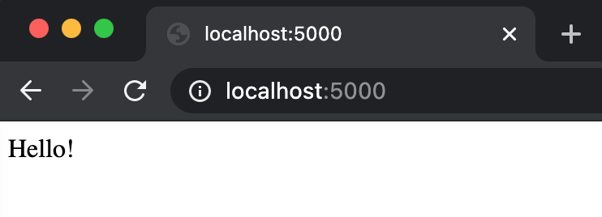

# Running Flask in Docker
This is a demo for packaging a tiny Flask app in Docker, mostly following this [incredibly helpful tutorial](https://www.fullstackpython.com/blog/develop-flask-web-apps-docker-containers-macos.html). (That tutorial is the only place I saw online, including the Docker documentation, for how to access the Docker container port on Mac. The trick is the `EXPOSE` line in the Dockerfile.)

## Steps
Download Docker for your operating system. Then write a tiny Flask app like this:

```python
from flask import Flask

app = Flask(__name__)

@app.route('/')
def index():
    return 'Hello!'

if __name__ == '__main__':
    app.run('0.0.0.0', port=80, debug=True)
```

The global host (`0.0.0.0`) and port (`80`) are important! Then, build a Dockerfile like this:

```dockerfile
# Use the Ubuntu OS Docker image
FROM ubuntu

# Update the Ubuntu packages
RUN apt-get update

# Install Python3, pip, and Flask
RUN apt-get install -y python3 python3-pip
RUN python3 -m pip install flask

# Copy the local app.py file to the Docker image directory
COPY app.py /opt/app.py

# Expose port 80 from the Docker container to the host
EXPOSE 80

# Run this code on starting the container
ENTRYPOINT python3 /opt/app.py
```

Now in Terminal, navigate to the directory with `app.py` and `Dockerfile` and type the following:

```bash
docker build . -t <your_name>/<your_app_name>
```

For me, for example, I would type `docker build . -t mgsosna/my_app`.

To access your app, launch the container. The following steps are important:
* The `-p` maps the port on *your machine* to the Docker container. The first number (`5000` below) isn't important, but the second number must be `80` (the port we exposed in our Dockerfile).
* Make sure to specify `-it` to connect your Terminal to the Docker container's Terminal (which lets you, for example, see the logs and shut down the container with `^C`).

```bash
docker run -it -p 5000:80 mgsosna/my_app
```

We'll see our Flask app running. Now the exciting bit: open a browser (e.g. Firefox) and navigate to `localhost:5000`.



Great work!
